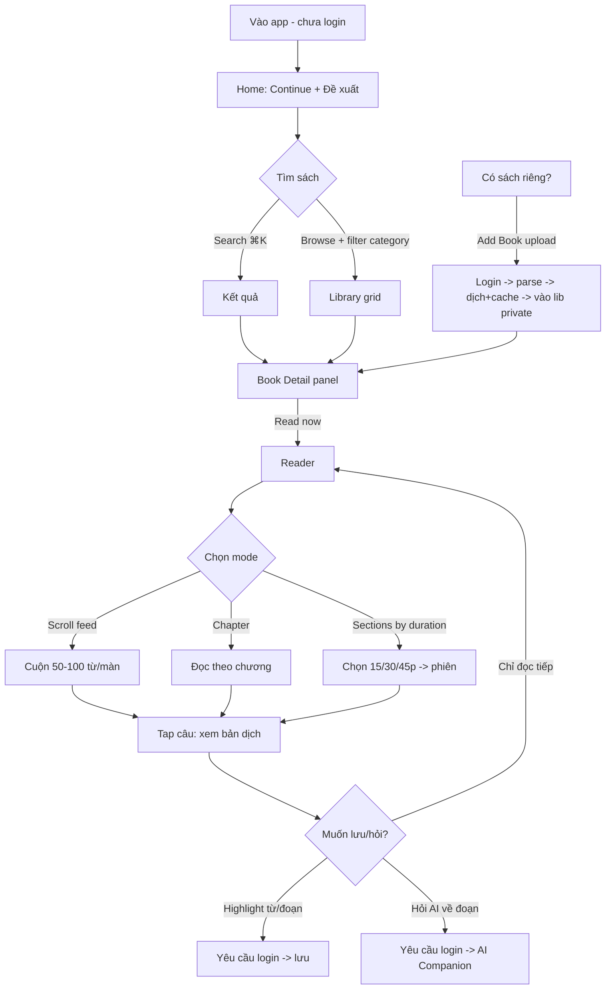

# READING TIME — Full-Flow Spec & Claude Design Prompt

> **App name:** Reading Time
> **Slogan:** *Turn wasted time into wonderful time.*
> **Một câu mô tả:** Một thư viện đọc song ngữ kiểu feed-scroll — bản "Duoreader nhiều feature hơn, dễ tiếp cận hơn". Cuộn để đọc, đọc để học tiếng.
>
> Tài liệu này vừa là **đặc tả sản phẩm + business flow + API**, vừa là **prompt để đưa cho Claude Design** dựng UI. Voice sản phẩm: **calm / cozy**, có nhấn nhẹ chống doomscroll.

---

## 0. CÁCH DÙNG TÀI LIỆU NÀY

- **Đưa cho Claude Design**: copy mục 1, 2, 5, 8, 9, 11 (sản phẩm + sitemap + trang + design system + reader + prompt). Đó là phần thị giác.
- **Đưa cho coding agent (Claude Code)**: copy mục 3, 4, 6, 7, 10, 12 (flow + auth + reading modes/API + filter + API reference + data model).
- Tên file/route dùng `reading-time` hoặc `readingtime`.

---

## 1. SẢN PHẨM & NGUYÊN TẮC

**Pitch:** "Reels cho việc đọc sách — *Turn wasted time into wonderful time.*"

**Nguyên tắc bất biến**
1. **Copyright-safe**: chỉ host sách public domain (Project Gutenberg / Standard Ebooks / Wikisource) HOẶC sách user tự upload (private theo account). Không host/bán sách bản quyền bên thứ ba.
2. **Free-to-run**: bám public domain + **cache mọi bản dịch vào DB** (không dịch nguyên cuốn theo thời gian thực).
3. **Read-first UX**: tối thiểu số trang giữa "mở app" và "đang đọc". Không bắt login để đọc.
4. **Bilingual mặc định** cho mọi sách free.
5. **Free vẫn miễn phí kể cả khi user upload sách của họ** — thuật toán (tách câu, dịch+cache, chia phiên) vẫn chạy.

**So với Duoreader (điểm hơn):** sidebar điều hướng gọn, scroll-feed mode kiểu Reels, chia sách theo thời lượng tự chọn, multi-thread AI reading companion, 2 theme + warm reading mode, filter đa danh mục, onboarding cực ngắn.

---

## 2. SITEMAP (ít trang — sidebar-driven)

Toàn app chạy trong **1 layout có sidebar trái cố định** (collapse được). Hạn chế điều hướng sâu.

```
┌─ Sidebar (luôn hiện) ─────────────┐
│  ◆ Reading Time (logo + slogan)   │
│                                    │
│  🏠 Home / Continue                │
│  📚 Library (Browse)               │
│  🔎 Search        (mở overlay)     │
│  🏷  Categories                    │
│  ⬆️  Add Book (upload)   [login]   │
│  💬 AI Companion         [login]   │
│  ⭐ My Vocabulary        [login]   │
│  🖍  Highlights          [login]   │
│  ──────────────                    │
│  ⚙️  Settings                      │
│  👤 Sign in / Avatar               │
└────────────────────────────────────┘
```

**Chỉ có 6 "trang" thật** (mọi thứ khác là overlay/panel):
1. **Home** (continue reading + đề xuất)
2. **Library/Browse** (grid sách + filter)
3. **Book Detail** (mở dạng panel trượt từ phải, KHÔNG rời trang library — giữ context)
4. **Reader** (toàn màn hình, ẩn sidebar)
5. **AI Companion** (chat, panel phải hoặc trang riêng)
6. **Settings / Profile**

Search = **overlay (⌘K)**, Categories = filter trên Library, Vocabulary/Highlights = panel. → Người dùng gần như không bao giờ "lạc trang" trước khi đọc được sách.

---

## 3. BUSINESS FLOW / USER JOURNEY



**Nguyên tắc flow:** mọi hành động "đọc/duyệt/đổi theme" → không chặn. Mọi hành động "lưu/upload/hỏi AI/sync" → mới hiện modal login (OAuth/SSO), login xong **quay lại đúng chỗ đang đọc** (không reset).

---

## 4. AUTH LOGIC (khi nào cần login)

| Hành động | Cần login? | Ghi chú |
|---|---|---|
| Duyệt Library, Categories, Search | ❌ | |
| Đọc sách public domain (mọi mode) | ❌ | reading_state lưu local (localStorage/cookie) cho guest |
| Đổi theme / font / customization | ❌ | lưu local |
| Xem bản dịch song ngữ | ❌ | |
| Highlight / lưu Vocabulary | ✅ | gắn user_id |
| Upload sách (Add Book) | ✅ | private theo account |
| AI Companion (chat) | ✅ | tốn token + lưu lịch sử |
| Sync nhiều thiết bị | ✅ | |

- **OAuth / SSO**: Google + GitHub (thêm Apple nếu có mobile). Dùng **NextAuth.js (Auth.js)** — hỗ trợ sẵn các provider + session JWT.
- **Guest → User merge**: khi guest login, merge reading_state/highlights local lên account.
- Modal login là **overlay**, không phải trang riêng → không phá flow đọc.

---

## 5. CHI TIẾT TỪNG TRANG

### 5.1 Home (`/`)
- **Hero gọn** (chỉ với guest hoặc lần đầu): illustration đọc sách + headline + slogan + nút **"Start reading"** (cuộn xuống / mở 1 sách nổi bật ngay). Không phải landing dài lê thê.
- **Continue reading**: card sách đang đọc + thanh progress + "X phút để xong chương này".
- **Đề xuất**: hàng ngang scroll theo "Short reads (<30p)", "Classics", "By genre".
- Với user đã đọc → Home mở thẳng vào Continue, hero thu nhỏ.

### 5.2 Library / Browse (`/library`)
- Grid card sách (cover/spine + title + author + genre chips + "~Xp đọc").
- **Filter bar trên cùng**: multi-select categories (xem mục 7), sort (mới/phổ biến/ngắn nhất), toggle "Có song ngữ", "Sách của tôi".
- Click card → **Book Detail panel** trượt ra (không rời trang).

### 5.3 Book Detail (panel phải)
- Cover lớn, title, author, mô tả, genre chips, độ dài (số từ + ước tính phút), ngôn ngữ có sẵn.
- **CTA chính: "Read now"** (to, nổi bật) → vào Reader.
- CTA phụ: "Add to my library", "Chọn mode đọc" (scroll/chapter/sections).
- Hiển thị: nếu chưa có bản dịch → "Bản dịch sẽ tạo khi bạn mở (miễn phí)".

### 5.4 Reader (`/read/:bookId`) — TRANG QUAN TRỌNG NHẤT
- **Toàn màn hình**, ẩn sidebar. Top bar mỏng tự ẩn khi cuộn (title + progress + nút Aa + nút mode + nút theme).
- **3 reading modes** (mục 6): Scroll feed / Chapter / Sections-by-duration.
- **Tương tác trong lúc đọc** (mục 9): tap câu → hiện bản dịch; bôi từ → dịch + lưu; nút **Aa** mở panel customization (font size, font family, bg/màu chữ trong giới hạn, theme).
- Bottom: nút "Hỏi AI về đoạn này" (login).
- Tự lưu vị trí đọc liên tục.

### 5.5 Search (overlay ⌘K)
- Gõ → gợi ý tức thì (title/author/genre). Typo-tolerant.
- Kết quả mở Book Detail panel. Không tạo trang search riêng.

### 5.6 Categories
- Không phải trang riêng — là **bộ filter** trên Library + một "Categories" view dạng lưới chip lớn để khám phá nhanh, click chip → Library đã áp filter.

### 5.7 Add Book / Upload (`/add`, login)
- Kéo-thả EPUB (không DRM). Hiện tiến trình: parse → tách câu → dịch+cache → xong.
- Ghi rõ: sách private, chỉ bạn thấy, bạn chịu trách nhiệm bản quyền nội dung upload.

### 5.8 AI Companion (`/chat`, login)
- **Multi-thread**: list thread bên trái (mỗi sách/chủ đề 1 thread), khung chat bên phải.
- Context-aware: có thể gắn đoạn đang đọc vào câu hỏi ("giải thích đoạn này", "tóm tắt chương", "từ này nghĩa gì trong ngữ cảnh").
- Dùng LLM rẻ + cache. (Tính năng giai đoạn sau.)

### 5.9 My Vocabulary / Highlights (panel, login)
- Vocabulary: danh sách từ đã lưu + trạng thái new/learning/known + câu ngữ cảnh + nút ôn (flashcard sau).
- Highlights: list theo sách, click → nhảy về đúng câu trong Reader.

### 5.10 Settings / Profile
- Ngôn ngữ giao diện (VI/EN), theme mặc định, font mặc định, wpm cá nhân (cho chia phiên), quản lý account/provider, xóa dữ liệu.

---

## 6. READING MODES & API RETURN SHAPES ⭐ (phần quan trọng)

### 6.1 Lấy cấu trúc sách (chương)
`GET /api/books/:id/structure`
```json
{
  "bookId": "gutenberg-1342",
  "title": "Pride and Prejudice",
  "langSrc": "en",
  "langTargets": ["vi"],
  "totalWords": 122189,
  "estMinutes": { "wpm": 200, "minutes": 611 },
  "chapters": [
    { "idx": 0, "title": "Chapter 1", "words": 998, "estMinutes": 5,
      "startSentenceId": "s_000001", "endSentenceId": "s_000061" },
    { "idx": 1, "title": "Chapter 2", "words": 1124, "estMinutes": 6,
      "startSentenceId": "s_000062", "endSentenceId": "s_000133" }
  ]
}
```

### 6.2 Đọc theo CHƯƠNG
`GET /api/books/:id/chapters/:idx?target=vi`
```json
{
  "bookId": "gutenberg-1342",
  "chapterIdx": 0,
  "title": "Chapter 1",
  "blocks": [
    {
      "paragraphIdx": 0,
      "sentences": [
        { "id": "s_000001", "src": "It is a truth universally acknowledged...",
          "tgt": "Có một sự thật ai cũng công nhận...", "words": 11 },
        { "id": "s_000002", "src": "However little known...",
          "tgt": "Dù người ta ít biết...", "words": 14 }
      ]
    }
  ],
  "nav": { "prevIdx": null, "nextIdx": 1 }
}
```
> `tgt` = bản dịch lấy từ cache; nếu chưa có, server dịch on-demand câu chưa có rồi cache lại (free tier), trả về luôn.

### 6.3 Đọc theo CHUNK / SCROLL FEED (50–100 từ/màn)
`GET /api/books/:id/read?mode=scroll&target=vi&cursor=s_000001&limit=20`
```json
{
  "mode": "scroll",
  "wordsPerScreen": 75,
  "screens": [
    {
      "screenId": "scr_0001",
      "wordCount": 78,
      "items": [
        { "id": "s_000001", "src": "...", "tgt": "...", "words": 11 },
        { "id": "s_000002", "src": "...", "tgt": "...", "words": 14 },
        { "id": "s_000003", "src": "...", "tgt": "...", "words": 19 }
      ]
    },
    {
      "screenId": "scr_0002",
      "wordCount": 71,
      "items": [ { "id": "s_000004", "src": "...", "tgt": "...", "words": 22 } ]
    }
  ],
  "nextCursor": "s_000061",
  "hasMore": true
}
```
> Server gom câu cho tới khi đạt `wordsPerScreen` (±, cắt ở cuối câu) → mỗi `screen` là 1 "trang Reels". Infinite scroll bằng `nextCursor`.

### 6.4 Chia theo THỜI LƯỢNG (sections-by-duration)
`POST /api/books/:id/sections`
```json
// request
{ "targetMinutes": 30, "wpm": 150, "boundary": "sentence" }
```
```json
// response
{
  "bookId": "gutenberg-1342",
  "targetMinutes": 30,
  "wpm": 150,
  "wordsPerSession": 4500,
  "sections": [
    { "idx": 0, "label": "Phiên 1 · ~30 phút",
      "startSentenceId": "s_000001", "endSentenceId": "s_000231",
      "words": 4480, "estMinutes": 30,
      "endsAt": "chapter-boundary" },
    { "idx": 1, "label": "Phiên 2 · ~30 phút",
      "startSentenceId": "s_000232", "endSentenceId": "s_000470",
      "words": 4512, "estMinutes": 30,
      "endsAt": "sentence-boundary" }
  ],
  "totalSections": 14
}
```
**Thuật toán (server):** duyệt sentences cộng dồn words; khi ≥ `wordsPerSession` → cắt ở cuối câu; nếu gần ranh giới đoạn/chương (lệch <15%) → ưu tiên cắt ở đó (`endsAt: "chapter-boundary"`). Mặc định `wpm=150` cho người đọc ngôn ngữ thứ hai (cho chỉnh trong Settings).

### 6.5 Lưu vị trí đọc
`PUT /api/reading-state/:bookId` → body `{ lastSentenceId, mode, wpmPref }`. Guest: lưu localStorage; user: lưu DB + trả về để sync.

---

## 7. MULTI-CATEGORY FILTER LOGIC

- **Genre**: many-to-many (`books.genre[]`). Filter cho phép chọn nhiều chip.
- **Logic mặc định: OR trong cùng nhóm, AND giữa các nhóm.**
  - Ví dụ: Genre = [Romance OR Adventure] **AND** Length = [<30p] **AND** Bilingual = true.
- Query string: `/library?genre=romance,adventure&maxMinutes=30&bilingual=1&sort=shortest&mine=0`
- API: `GET /api/books?genre=romance,adventure&maxMinutes=30&bilingual=1&sort=shortest&cursor=...`
```json
{
  "items": [
    { "id": "gutenberg-1342", "title": "...", "author": "...",
      "genre": ["romance","classic"], "estMinutes": 611,
      "hasBilingual": true, "cover": "https://..." }
  ],
  "facets": {
    "genre": [ {"key":"romance","count":120}, {"key":"adventure","count":88} ],
    "length": [ {"key":"<30","count":40}, {"key":"30-120","count":150} ]
  },
  "nextCursor": "...", "total": 208
}
```
> Trả kèm `facets` để UI hiện số lượng cạnh mỗi chip (như Duoreader/marketplace). MVP dùng Postgres FTS + GIN index trên `genre[]`; scale → Meilisearch.

---

## 8. DESIGN SYSTEM ⭐ (đưa cho Claude Design)

### 8.1 Tone & aesthetic direction
**Cozy editorial / warm paper.** Không "AI slop" (tránh purple gradient trên nền trắng, tránh Inter/Roboto). Cảm giác: một thư viện ấm, giấy ngà, ánh đèn vàng — đối lập với cái lạnh của feed mạng xã hội. Có chuyển động nhẹ, staggered reveal khi load, hover tinh tế.

### 8.2 Color tokens

**Light (ấm, KHÔNG chói — nền giấy ngà, chữ không đen tuyền):**
```css
--bg:        #FAF6EE;  /* giấy ngà ấm, không phải #FFF */
--surface:   #FFFFFFE6;
--surface-2: #F1EADC;
--text:      #2C2A26;  /* near-black ấm */
--text-muted:#6E685E;
--border:    #E4DCCB;
--accent:    #C4663A;  /* terracotta/amber ấm */
--accent-2:  #2F7E78;  /* teal trầm cho link phụ */
--highlight: #F3E2A4;  /* vàng nhạt bôi từ */
```

**Dark (chữ sáng nhưng DỊU — không trắng tuyền trên đen tuyền):**
```css
--bg:        #17161B;  /* đen ấm hơi tím-nâu */
--surface:   #201E25;
--surface-2: #2A2731;
--text:      #E9E3D7;  /* off-white ấm, KHÔNG #FFF */
--text-muted:#9C958A;
--border:    #322E38;
--accent:    #E0905C;  /* amber sáng vừa cho nền tối */
--accent-2:  #5FB8AF;
--highlight: rgba(243,226,164,0.16);
```

**Warm reading mode** (tùy chọn nền thứ 3 *bên trong Reader*, không phải theme toàn app):
```css
--reader-bg:   #F1E7CF;  --reader-text: #3A3326;
```
> Quy tắc: **dark theme không bao giờ đi với chữ đen**; light không bao giờ trắng tuyền/đen tuyền. Contrast tối thiểu AA (≥4.5:1 cho body).

### 8.3 Typography (có hỗ trợ tiếng Việt đầy đủ)
- **Display / headings:** `Fraunces` (serif có "soul", hỗ trợ VI) — cho logo, hero, tiêu đề.
- **Body reading:** `Literata` (font Google Books, thiết kế để đọc dài, VI tốt) — mặc định trong Reader.
- **UI / sans:** `Be Vietnam Pro` (thiết kế cho tiếng Việt) hoặc `Hanken Grotesk` — nav, nút, label.
- **Reader cho user chọn:** Serif (Literata) / Sans (Be Vietnam Pro) / Dyslexic (OpenDyslexic).
- KHÔNG dùng Inter/Roboto/Arial/Space Grotesk.

### 8.4 Layout & spacing
- Sidebar trái 240px (collapse → 64px icon-only). Content max-width ~1100px, Reader max-width ~680px (dòng ~66 ký tự — chuẩn đọc).
- Bo góc 12–16px, shadow mềm ấm (không shadow xám lạnh). Spacing scale 4/8/12/16/24/32/48.

### 8.5 SVG illustration briefs (cartoon đọc sách, line-art + soft fill, palette accent ấm)
Cùng phong cách: nét đồng đều, bo tròn, thân thiện, tô màu phẳng theo `--accent`/`--accent-2`, có vài chấm/đường trang trí. Dùng `currentColor` để tự đổi theo theme.
1. **Hero:** một người ngồi đọc trong ghế bành, quanh đầu nổi các "bong bóng từ" song ngữ (vd "rain ↔ mưa", "moon ↔ trăng") bay lên thay vì các icon notification mạng xã hội. Tinh thần: biến thời gian lướt thành thời gian đọc. Kèm nút **"Read now"**.
2. **Empty library:** kệ sách trống + cây nến → "Chưa có sách trong thư viện".
3. **Empty vocabulary:** lọ thủy tinh đựng chữ cái → "Lưu từ đầu tiên của bạn".
4. **Upload:** đám mây + cuốn sách đi vào → trạng thái upload.
5. **AI Companion:** cuốn sách có bong bóng thoại → chat.
6. **Category icons** (line, đồng bộ): Romance (tim+sách), Adventure (la bàn), Classic (cột đền), Mystery (kính lúp), Sci-Fi (hành tinh), Short reads (đồng hồ cát).
7. **Loading/finished:** đồng hồ cát chảy thành trang sách (gắn với slogan "wonderful time").

### 8.6 Motion
- Page load: staggered reveal (cards lên dần, 40–60ms/step).
- Reader scroll-feed: snap mềm giữa các "screen", fade-in câu.
- Hover card: nhấc nhẹ + shadow ấm đậm hơn. Theme switch: cross-fade màu 200ms.

---

## 9. READER INTERACTION SPEC (chi tiết)

| Hành động | Kết quả |
|---|---|
| Tap 1 câu (src) | Hiện bản dịch (`tgt`) ngay dưới câu, highlight nhẹ câu nguồn |
| Tap 1 từ | Popover: nghĩa + nút "Lưu vào Vocabulary" (login) + phát âm (sau) |
| Bôi (select) đoạn | Thanh nổi: Highlight (chọn màu) / Dịch / Hỏi AI |
| Nút **Aa** | Panel: font size (−/+), font family (Serif/Sans/Dyslexic), line-height, độ rộng, nền đọc (Light/Dark/Warm), màu chữ (preset trong giới hạn để giữ contrast) |
| Nút **Mode** | Scroll feed / Chapter / Sections-by-duration (nếu chọn duration → hỏi 15/30/45p) |
| Nút **Theme** | Toggle Light/Dark (warm là tùy chọn nền trong panel Aa) |
| Toggle dịch | Ẩn hết / Hiện khi tap / Hiện song song mọi câu |
| Cuộn | Top bar tự ẩn; progress cập nhật; auto-save vị trí |

- **Giới hạn customization** (giữ UI sạch + contrast): font size 14–24px; màu chữ chỉ chọn từ palette hợp lệ theo nền đang dùng (không cho chữ tối trên nền tối). Mọi lựa chọn lưu vào `prefs` (local cho guest, DB cho user).

---

## 10. API REFERENCE (tổng hợp)

```
# Public (không cần auth)
GET    /api/books?genre=&maxMinutes=&bilingual=&sort=&cursor=     # list + facets (mục 7)
GET    /api/books/:id                                            # detail
GET    /api/books/:id/structure                                  # chapters (6.1)
GET    /api/books/:id/chapters/:idx?target=vi                    # đọc chương (6.2)
GET    /api/books/:id/read?mode=scroll&target=vi&cursor=&limit=  # scroll feed (6.3)
POST   /api/books/:id/sections                                   # chia thời lượng (6.4)
GET    /api/search?q=                                            # search overlay
GET    /api/categories                                           # chip + count
PUT    /api/reading-state/:bookId                                # guest=local fallback (6.5)

# Auth (NextAuth/Auth.js)
GET    /api/auth/[...nextauth]                                   # Google/GitHub OAuth-SSO
GET    /api/me                                                   # profile + prefs

# Protected (cần session)
POST   /api/upload                                               # BYOB EPUB -> parse+cache
GET    /api/library                                              # sách của tôi (public + upload)
POST   /api/highlights        GET /api/highlights?bookId=
POST   /api/vocab             GET /api/vocab        PATCH /api/vocab/:id (status)
GET    /api/chat/threads      POST /api/chat/threads
POST   /api/chat/threads/:id/messages                           # AI companion (LLM + cache)
PATCH  /api/me/prefs                                            # theme/font/wpm sync
```

**Pipeline dịch (free):** request đọc → server kiểm `translations` cache theo `sentenceId+lang` → câu nào thiếu mới gọi Azure/Google → lưu cache → trả về. Không bao giờ dịch lại câu đã có.

---

## 11. PROMPT ĐỂ ĐƯA CHO CLAUDE DESIGN (copy nguyên khối)

```
Thiết kế UI cho web app "Reading Time" — slogan "Turn wasted time into wonderful time".
Đây là thư viện đọc sách song ngữ (Anh–Việt) kiểu feed-scroll, đối thủ là Duoreader
nhưng gọn và dễ tiếp cận hơn. Voice: calm, cozy, warm editorial — đối lập sự lạnh lẽo
của mạng xã hội. TUYỆT ĐỐI tránh AI-slop: không Inter/Roboto/Arial, không purple gradient
trên nền trắng.

LAYOUT: một sidebar trái cố định (collapse được) điều hướng toàn app; hạn chế tối đa số
trang. Search là overlay ⌘K, Book Detail là panel trượt từ phải (không rời Library),
Categories là filter chip. Ưu tiên UX: từ lúc mở app đến lúc đọc được sách càng ít bước
càng tốt. KHÔNG bắt login để đọc/duyệt/đổi theme; chỉ bắt login khi: upload sách, lưu
highlight/vocabulary, dùng AI Companion.

MÀN HÌNH CẦN THIẾT KẾ: (1) Home với hero gọn + "Continue reading" + đề xuất theo hàng ngang;
(2) Library grid + filter bar đa danh mục; (3) Book Detail panel với CTA "Read now" nổi bật;
(4) Reader toàn màn hình (đây là màn quan trọng nhất) — có 3 mode: scroll-feed 50–100 từ/màn,
đọc theo chương, chia theo thời lượng; tap câu hiện bản dịch tiếng Việt dưới câu; nút Aa để
chỉnh font size/font family (Serif/Sans/Dyslexic)/nền (Light/Dark/Warm)/màu chữ trong giới hạn;
top bar mỏng tự ẩn khi cuộn; (5) AI Companion chat đa thread; (6) Settings.

HAI THEME:
- Light ẤM, không chói: nền giấy ngà #FAF6EE, chữ near-black ấm #2C2A26, accent terracotta
  #C4663A, highlight vàng nhạt #F3E2A4. KHÔNG dùng trắng tuyền/đen tuyền.
- Dark DỊU mắt: nền đen ấm #17161B, chữ off-white ấm #E9E3D7 (không #FFF), accent amber #E0905C.
  Dark KHÔNG bao giờ đi với chữ đen. Contrast tối thiểu AA.
- Reader có thêm nền "Warm/sepia" #F1E7CF / chữ #3A3326.

TYPOGRAPHY (đủ dấu tiếng Việt): Display = Fraunces; Body đọc = Literata; UI = Be Vietnam Pro.
Reader cho chọn Serif/Sans/Dyslexic (OpenDyslexic). Content max-width Reader ~680px (~66 ký tự/dòng).

SVG ILLUSTRATIONS (cartoon line-art + soft fill, dùng currentColor để đổi theo theme, palette ấm):
- Hero: người ngồi đọc, bong bóng "từ song ngữ" (rain↔mưa, moon↔trăng) bay lên thay cho icon
  notification mạng xã hội; kèm nút "Read now".
- Empty states (library trống, vocabulary trống), upload (mây + sách), AI (sách có bong bóng thoại).
- Bộ category icon đồng bộ: Romance, Adventure, Classic, Mystery, Sci-Fi, Short reads.
- Loading: đồng hồ cát chảy thành trang sách (gắn slogan).

MOTION: staggered reveal khi load (40–60ms/step), snap mềm + fade câu trong scroll-feed,
hover card nhấc nhẹ với shadow ấm, theme switch cross-fade 200ms.

Hãy thiết kế từng màn hình theo thứ tự: Home → Library → Book Detail panel → Reader (kỹ nhất,
gồm cả panel Aa và 3 mode) → AI Companion → Settings. Mỗi màn xuất cả light & dark.
```

---

## 12. DATA MODEL DELTA (bổ sung so với bản trước)

```
chat_threads    (id, user_id, book_id?, title, created_at)
chat_messages   (id, thread_id, role, content, context_ref?, tokens, created_at)
                 -- role: user|assistant ; context_ref: sentence range gắn kèm
prefs (trong users.prefs_json):
  { theme: 'light'|'dark', readerBg: 'light'|'dark'|'warm',
    font: 'serif'|'sans'|'dyslexic', fontSize: 14..24, lineHeight, textColor,
    uiLang: 'vi'|'en', wpm: 150, defaultMode: 'scroll'|'chapter'|'sections',
    showTranslation: 'hidden'|'on-tap'|'parallel' }
```
*(Các bảng còn lại — users, books, chapters, paragraphs, sentences, translations, highlights, vocab, reading_state, sessions, user_books — giữ nguyên như bản spec trước.)*

---

name: reading-time-design
description: Use this skill to generate well-branded interfaces and assets for Reading Time, either for production or throwaway prototypes/mocks/etc. Contains essential design guidelines, colors, type, fonts, assets, and UI kit components for prototyping. Reading Time is a cozy, warm-editorial bilingual (English↔Vietnamese) feed-scroll reading app — "Turn wasted time into wonderful time."
user-invocable: true
---

Read the `readme.md` file within this skill, and explore the other available files.

Reading Time is a calm, cozy, warm-paper reading app — the deliberate opposite of a cold social feed. Core rules to honour:
- **Never pure white / pure black.** Light = warm ivory `#FAF6EE` on `#2C2A26`; dark = warm near-black `#17161B` on off-white `#E9E3D7`. Dark theme never pairs with black text.
- **Type:** Fraunces (display), Literata (body reading), Be Vietnam Pro (UI). All cover full Vietnamese diacritics. Never Inter/Roboto/Arial.
- **Accent** is terracotta `#C4663A` (amber `#E0905C` in dark), used sparingly for the primary CTA ("Read now"), active nav, key affordances.
- **Warm soft shadows**, 12–16px radii, line-art illustrations that recolour via `currentColor`.
- **Tone:** sentence case, second-person ("you"/"bạn"), encouraging, no hype, no stat-slop. Bilingual word-pairs use the `↔` glyph.

If creating visual artifacts (slides, mocks, throwaway prototypes, etc), copy assets out (`assets/`) and create static HTML files for the user to view — link `styles.css` for tokens, and inline the brand SVGs so they pick up `currentColor`. If working on production code, copy assets and read the rules here to become an expert in designing with this brand; the React primitives live in `components/` and full-screen recreations in `ui_kits/reading-time/`.

If the user invokes this skill without any other guidance, ask them what they want to build or design, ask some questions, and act as an expert designer who outputs HTML artifacts _or_ production code, depending on the need.

## Map
- `readme.md` — the full design guide (product context, content fundamentals, visual foundations, iconography, index).
- `styles.css` → `tokens/` — colours (light/dark/reader-warm), typography, spacing/radius/shadow, fonts, base.
- `assets/logo/`, `assets/illustrations/` — brand mark, hero, empty states, upload, AI, loading, and the 6 category icons.
- `components/` — Button, IconButton, Badge, Tag, Avatar, Input, Switch, BookCard, ProgressBar, SidebarItem, GenreChip, BilingualSentence (each with `.d.ts` + `.prompt.md`).
- `ui_kits/reading-time/` — the full interactive app recreation (Home, Library + Book Detail, Reader, AI Companion, Settings).
- `guidelines/` — foundation specimen cards.


---
name: reading-time-design
description: Use this skill to generate well-branded interfaces and assets for Reading Time, either for production or throwaway prototypes/mocks/etc. Contains essential design guidelines, colors, type, fonts, assets, and UI kit components for prototyping. Reading Time is a cozy, warm-editorial bilingual (English↔Vietnamese) feed-scroll reading app — "Turn wasted time into wonderful time."
user-invocable: true
---

Read the `readme.md` file within this skill, and explore the other available files.

Reading Time is a calm, cozy, warm-paper reading app — the deliberate opposite of a cold social feed. Core rules to honour:
- **Never pure white / pure black.** Light = warm ivory `#FAF6EE` on `#2C2A26`; dark = warm near-black `#17161B` on off-white `#E9E3D7`. Dark theme never pairs with black text.
- **Type:** Fraunces (display), Literata (body reading), Be Vietnam Pro (UI). All cover full Vietnamese diacritics. Never Inter/Roboto/Arial.
- **Accent** is terracotta `#C4663A` (amber `#E0905C` in dark), used sparingly for the primary CTA ("Read now"), active nav, key affordances.
- **Warm soft shadows**, 12–16px radii, line-art illustrations that recolour via `currentColor`.
- **Tone:** sentence case, second-person ("you"/"bạn"), encouraging, no hype, no stat-slop. Bilingual word-pairs use the `↔` glyph.

If creating visual artifacts (slides, mocks, throwaway prototypes, etc), copy assets out (`assets/`) and create static HTML files for the user to view — link `styles.css` for tokens, and inline the brand SVGs so they pick up `currentColor`. If working on production code, copy assets and read the rules here to become an expert in designing with this brand; the React primitives live in `components/` and full-screen recreations in `ui_kits/reading-time/`.

If the user invokes this skill without any other guidance, ask them what they want to build or design, ask some questions, and act as an expert designer who outputs HTML artifacts _or_ production code, depending on the need.

## Map
- `readme.md` — the full design guide (product context, content fundamentals, visual foundations, iconography, index).
- `styles.css` → `tokens/` — colours (light/dark/reader-warm), typography, spacing/radius/shadow, fonts, base.
- `assets/logo/`, `assets/illustrations/` — brand mark, hero, empty states, upload, AI, loading, and the 6 category icons.
- `components/` — Button, IconButton, Badge, Tag, Avatar, Input, Switch, BookCard, ProgressBar, SidebarItem, GenreChip, BilingualSentence (each with `.d.ts` + `.prompt.md`).
- `ui_kits/reading-time/` — the full interactive app recreation (Home, Library + Book Detail, Reader, AI Companion, Settings).
- `guidelines/` — foundation specimen cards.
